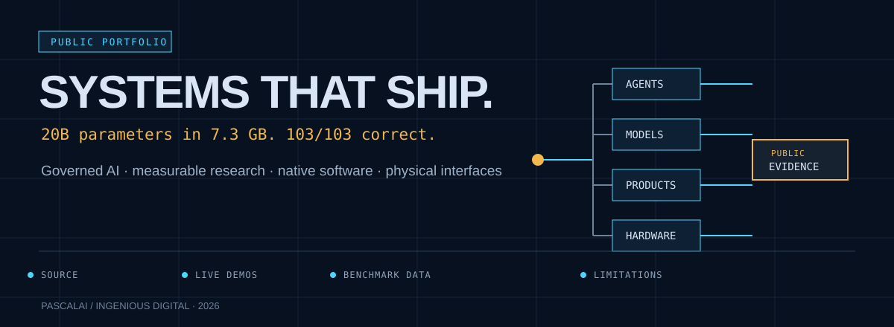
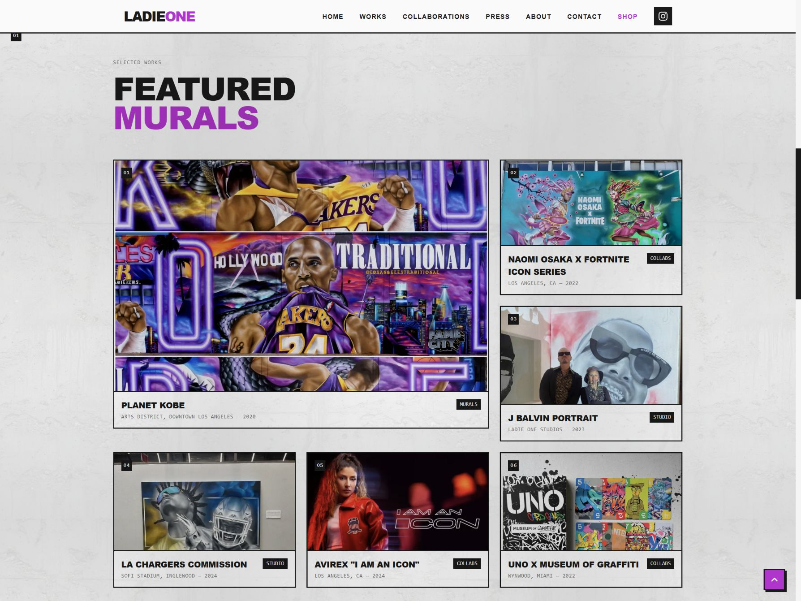
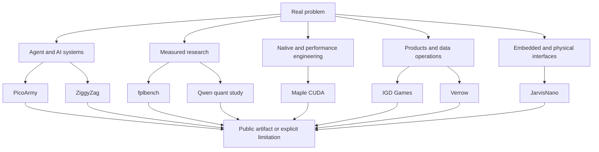

  

# PascalAI — Selected Engineering Work

  <strong>20B parameters in 7.3&nbsp;GB. Forecasts graded after the whistle. A shell that asks first.</strong> 
  Selected public work from PascalAI and Ingenious Digital.

  <a href="#the-work">The work</a> ·
  <a href="#the-range">Capability range</a> ·
  <a href="case-studies/README.md">Case studies</a> ·
  <a href="proof/README.md">Evidence ledger</a> ·
  <a href="https://ingeniousdigital.com/contact">Work together</a>

---

## The short version

This portfolio covers an unusual but coherent range: governed agent systems,
applied machine learning, GPU performance engineering, native developer tools,
web products, data operations, and embedded AI.

For a wider product view, visit [IGD/dev](https://igddev.com). For commercial
work, use the [Ingenious Digital contact page](https://ingeniousdigital.com/contact).

## The work

### Production systems · JarvisMCP, ButlerCRM and Overwatch

I build and operate the applications around the AI integration: **JarvisMCP**
connects agents to discoverable capabilities and durable task coordination;
**[ButlerCRM](https://butlercrm.com)** brings business workflows into a configurable
application shell; **Overwatch** connects search and analytics data with an
operational interface. These systems have private source. Their public case
studies explain the engineering without presenting private code as open source.

**Explore:** [JarvisMCP architecture](case-studies/jarvismcp.md) ·
[Overwatch case study](case-studies/overwatch.md) ·
[current professional profile](https://www.linkedin.com/in/pascal-l-7ab39b3b/)

### Client delivery · Ladie One

An artist portfolio built around the work itself: an asymmetric mural
showcase, categorized galleries, keyboard-accessible image viewing and a
responsive artist story. I designed and developed the website; the artwork
and the artist's brand collaborations remain hers.

**Explore:** [project story and real desktop/mobile gallery](case-studies/ladie-one.md) ·
[live website](https://ladieone.com/)

### 01 · [fplbench](https://github.com/PascalAI2024/fplbench) — applied ML that keeps score

A leakage-safe Fantasy Premier League dataset and forecasting system. Forecasts
are committed before each deadline, the model plays its own public team, and
automation grades the frozen forecast against official actuals after the
gameweek. The public surface includes source, validation artifacts, a Hugging
Face dataset, a living board, and an explicit corrections trail.

**Inspect:** [repository](https://github.com/PascalAI2024/fplbench) ·
[dataset](https://huggingface.co/datasets/x0me/fplbench) ·
[live board](https://huggingface.co/spaces/x0me/fplbench-board) ·
[case study](case-studies/fplbench.md)

   
  Public prediction surface; the committed forecast is scored after the gameweek.

### 02 · [Maple CUDA](https://github.com/PascalAI2024/maple-preview-windows-cuda) — performance with correctness gates

Seven local CUDA patches made a 20B-A1B ternary model practical on a 16 GB GPU.
The work records the failed paths as well as the winning ones: generation moved
from 52 to 377 tokens/s in the original controlled series, a fresh A/B/B/A run
moved prompt processing from 1,457 to 10,674 tokens/s, and every enabled build
passed the 103-case CPU-reference matrix.

**Inspect:** [repository](https://github.com/PascalAI2024/maple-preview-windows-cuda) ·
[benchmark dataset](https://huggingface.co/datasets/x0me/maple-preview-cuda-benchmarks) ·
[case study](case-studies/maple-cuda.md)

### 03 · [ZiggyZag](https://github.com/PascalAI2024/ZiggyZag) — native software with an approval boundary

An all-Zig shell workspace combining a readable shell core, native Windows and
macOS terminal hosts, a cross-platform launcher, and a local AI sidecar. The
agent can propose mutations; the host owns the approval. The repository exposes
the process boundaries, release artifacts, platform caveats, and conformance
tests rather than hiding them behind a product screenshot.

**Inspect:** [repository](https://github.com/PascalAI2024/ZiggyZag) ·
[releases](https://github.com/PascalAI2024/ZiggyZag/releases) ·
[case study](case-studies/ziggyzag.md)

### 04 · [JarvisNano](https://github.com/PascalAI2024/JarvisNano) — AI becomes a physical interaction problem

ESP32-S3 firmware for a small desktop assistant with a round AMOLED display,
touch, microphone and speaker paths, live voice, device diagnostics, and a
guarded tool bridge. The active v1 target is real hardware; unfinished tracks
remain labeled as such.

**Inspect:** [repository](https://github.com/PascalAI2024/JarvisNano) ·
[architecture](https://github.com/PascalAI2024/JarvisNano/blob/main/docs/ARCHITECTURE.md) ·
[case study](case-studies/jarvisnano.md)

   
  Current public hardware target and interaction surface.

## The range

### More public work

- **[IGD Games](https://games.igddev.com)** — a playable browser-game lab spanning
  circuit puzzles, colony routing, Latvian folklore and tactical prototypes.
  Try **Gizmo Works**, **SubTerra Lite**, and **Papardes Zieds** in the browser.
  The demos are public; source is private and release maturity varies by game.
  [Project story](case-studies/igd-games.md).

- **[PicoArmy](https://github.com/PascalAI2024/picoarmy)** — a public
  TypeScript/PostgreSQL prototype for supervised self-hosted agent fleets,
  scoped MCP access, and audited operations. No public deployment is claimed.
- **[Qwen quant benchmark](https://github.com/PascalAI2024/qwen38-27b-quant-bench)** —
  sub-2-bit quantization and speculative-decoding research with raw results,
  limitations, and a corrections log.
- **[Verrow](https://github.com/PascalAI2024/verrow)** — an open lead-data
  quality workbench; ingestion and mapping are implemented while later data
  surfaces remain explicitly labeled as prototype work.

The [public project index](docs/PUBLIC_PROJECT_INDEX.md) includes the wider
catalogue and explains why some repositories are supporting evidence rather
than flagships.

## Checks

The automated [portfolio quality workflow](https://github.com/PascalAI2024/portfolio/actions/workflows/portfolio-quality.yml)
checks the internal evidence graph on every push to `main`, and on pull
requests. The [evidence ledger](proof/README.md) records the public artifacts
behind the headline claims.

## Explore the record

- [Published case studies](case-studies/README.md)
- [Portfolio atlas](docs/PORTFOLIO_ATLAS.md)
- [Public project index](docs/PUBLIC_PROJECT_INDEX.md)
- [Capability map](capabilities/README.md)
- [Public-safe system shapes](architecture/README.md)
- [Evidence ledger](proof/README.md)
- [Public boundaries](PUBLIC_BOUNDARIES.md)
- [Portfolio changelog](CHANGELOG.md)

Source-private work appears only as clearly labeled context. It is never counted
as public proof simply because a description sounds plausible.

## Work together

The best fit is work that needs both product judgment and engineering depth:
applied AI, agent infrastructure, custom software, performance work, research
systems, and complex prototypes that need to become maintainable products.

**[Start a conversation with Ingenious Digital →](https://ingeniousdigital.com/contact)**

---

Public portfolio refreshed 4 September 2026. © PascalAI. Selected work only.
