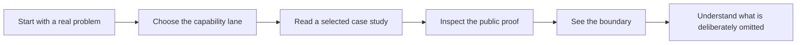

# PascalAI — Selected Work

> Systems with taste. Products with proof.

This is a public record of how PascalAI and Ingenious Digital approach difficult
product work: reduce the interface to what matters, make the system legible,
and keep human judgment at the decisive point. It is intentionally a
documentation-first portfolio—not a code dump, a client list, or an operating
manual.

## Start here

| If you care about | Begin with |
| --- | --- |
| Agent systems with real boundaries | [JarvisMCP](case-studies/jarvismcp.md) |
| Search intelligence and practical decision support | [Overwatch](case-studies/overwatch.md) |
| Maintainable web and commerce operations | [IGD WP](case-studies/igd-wp.md) |
| Native desktop engineering and local AI | [ZiggyZag](case-studies/ziggyzag.md) |
| Hardware, interaction, and embodied AI | [JarvisNano](case-studies/jarvisnano.md) |
| Privacy-first developer tooling | [VibeFlow](case-studies/vibeflow.md) |

These are working drafts, grounded in public project records. A draft is a
statement of scope, not a victory lap. It becomes publishable only after the
proof and public boundary have both been reviewed.

## The capability map

| Capability lane | The practical question | Selected proof |
| --- | --- | --- |
| Agent systems | How can a capable agent act without becoming an unaccountable one? | [JarvisMCP](case-studies/jarvismcp.md), [ZiggyZag](case-studies/ziggyzag.md) |
| Intelligence products | How can dispersed data become a useful decision surface? | [Overwatch](case-studies/overwatch.md) |
| Product platforms | How can a complex capability stay modular and understandable? | [IGD WP](case-studies/igd-wp.md) |
| Interactive systems | How can voice, touch, display, and tools feel like one object? | [JarvisNano](case-studies/jarvisnano.md) |
| Local-first tools | How can a useful personal tool remain private by default? | [VibeFlow](case-studies/vibeflow.md) |

For the wider lens, see the [portfolio atlas](docs/PORTFOLIO_ATLAS.md),
[capability map](capabilities/README.md), [public-safe system shapes](architecture/README.md),
and [cleared proof standard](proof/README.md).

## What a case study proves

Each case study answers the same seven questions:

1. What was the brief?
2. What constraints actually mattered?
3. What decisive move shaped the work?
4. What is the high-level system shape?
5. What public proof supports the story?
6. What did the work establish or teach?
7. What is deliberately not public?

That last question is not decorative. Good work should be visible; proprietary
method, client data, credentials, private source, and production access paths
should not.

## Explore the record

- [Case-study index](case-studies/README.md)
- [Portfolio atlas](docs/PORTFOLIO_ATLAS.md)
- [System-shape gallery](architecture/README.md)
- [Public boundaries](PUBLIC_BOUNDARIES.md)
- [Publishing guide](docs/PUBLISHING_GUIDE.md)

---

© PascalAI. Selected work only.
