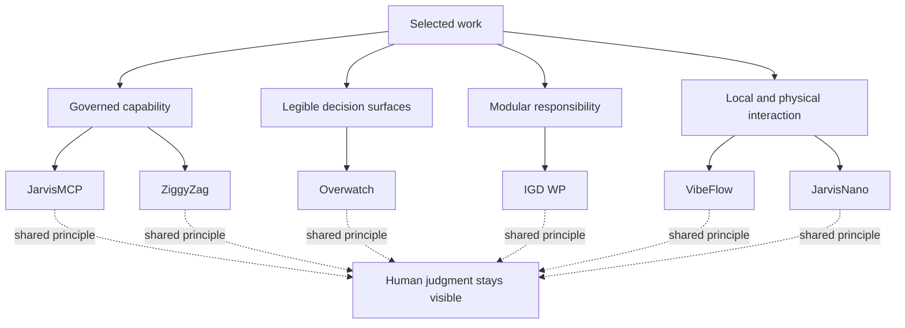

# Capability Constellation

The selected projects differ in medium—gateway, web application, plugin,
desktop tool, and device—but they repeat a small set of design commitments:
legible surfaces, modular responsibility, and a visible human role.

This is a conceptual map rather than a dependency graph. It does not imply that
the projects share code, customers, infrastructure, or production services.
For the project-level evidence, use the [case-study index](../case-studies/README.md).
