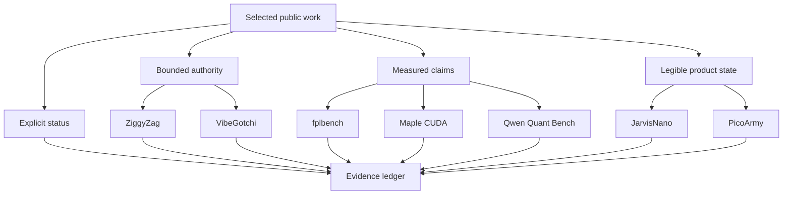

# Capability Constellation

The projects differ in medium, but repeat four design commitments: measurable
claims, legible state, bounded authority, and explicit current status.

This is a conceptual map, not a dependency graph. It does not imply that the
projects share code, customers, infrastructure, or production services. Follow
the [case-study index](../case-studies/README.md) for project-level evidence.
