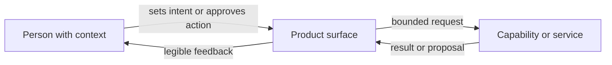

# Human-in-the-Loop Boundary

Across the selected work, automation is framed as assistance inside an
understandable product surface—not as an invisible substitute for the person
responsible for the outcome.

The exact implementation varies by project. In
[ZiggyZag](../case-studies/ziggyzag.md), the native host owns approval before an
agent mutation reaches the terminal. In
[fplbench](../case-studies/fplbench.md), the human boundary is the frozen
pre-deadline artifact and the refusal to rewrite it after the outcome. In
[VibeGotchi](../case-studies/vibegotchi.md), it is the visible read-only GitHub
permission model. The diagram intentionally omits private execution details.
