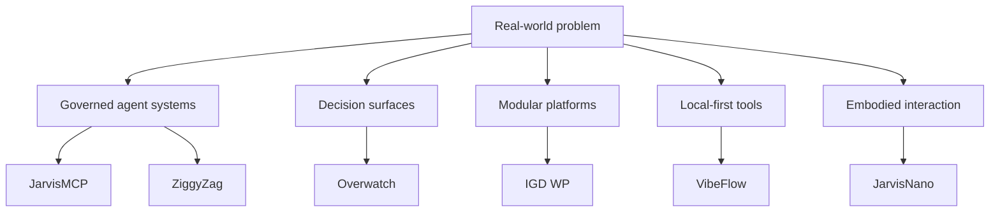

# Capability Map

The portfolio is organised by the problem being solved, not by a catalogue of
frameworks. The map below is deliberately selective: it links only work that
has a public project record and a reviewed public boundary.

| Capability lane | The recurring design question | Selected work | Public evidence |
| --- | --- | --- | --- |
| Governed agent systems | How can an agent gain capability without losing accountability? | [JarvisMCP](../case-studies/jarvismcp.md), [ZiggyZag](../case-studies/ziggyzag.md) | [Gateway record](https://mcp.igddev.com/mcp), [desktop source](https://github.com/PascalAI2024/ZiggyZag) |
| Decision surfaces | How can scattered signals turn into a useful next action? | [Overwatch](../case-studies/overwatch.md) | [Product record](https://overwatch.igddev.com) |
| Modular product platforms | How can a broad control surface stay understandable and optional? | [IGD WP](../case-studies/igd-wp.md) | [Public source](https://github.com/PascalAI2024/igd-wp) |
| Local-first desktop tools | How can useful AI preserve privacy and operator control? | [VibeFlow](../case-studies/vibeflow.md), [ZiggyZag](../case-studies/ziggyzag.md) | [VibeFlow source](https://github.com/PascalAI2024/VibeFlow), [ZiggyZag source](https://github.com/PascalAI2024/ZiggyZag) |
| Embodied interaction | How can touch, voice, display, and tools feel like one object? | [JarvisNano](../case-studies/jarvisnano.md) | [Public source](https://github.com/PascalAI2024/JarvisNano) |

Every lane must link to a case study or public proof before it is expanded. For
the connected overview, return to the [portfolio atlas](../docs/PORTFOLIO_ATLAS.md).
