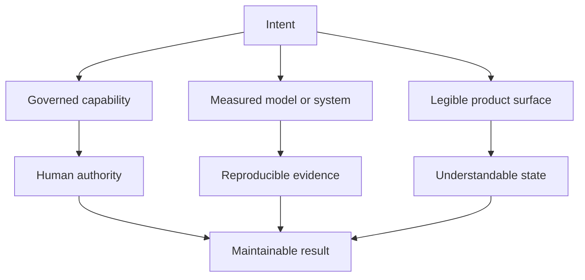

# Capability Map

The portfolio is organized by recurring engineering problems rather than a
framework inventory.

| Capability lane | Practical question | Strongest public evidence |
| --- | --- | --- |
| Governed agent systems | How can software gain useful capability without losing accountability? | [ZiggyZag](../case-studies/ziggyzag.md), [PicoArmy](https://github.com/PascalAI2024/picoarmy) |
| Applied ML and data | Can a model preserve time, provenance, and a fair scoring contract? | [fplbench](../case-studies/fplbench.md), [Verrow](https://github.com/PascalAI2024/verrow) |
| Inference and performance | Can optimization improve the real bottleneck while matching a correctness reference? | [Maple CUDA](../case-studies/maple-cuda.md), [Qwen Quant Bench](../case-studies/qwen-quant-bench.md) |
| Native developer tools | Can a complex local tool remain readable, portable, and approval-aware? | [ZiggyZag](../case-studies/ziggyzag.md) |
| Web products | Can permission boundaries and scoring logic become visible product features? | [VibeGotchi](../case-studies/vibegotchi.md) |
| Embedded interaction | Can voice, touch, display, and tools feel like one understandable object? | [JarvisNano](../case-studies/jarvisnano.md) |

The [public project index](../docs/PUBLIC_PROJECT_INDEX.md) records supporting
projects and their current evidence posture. Source-private notes are kept
separate from public proof.
