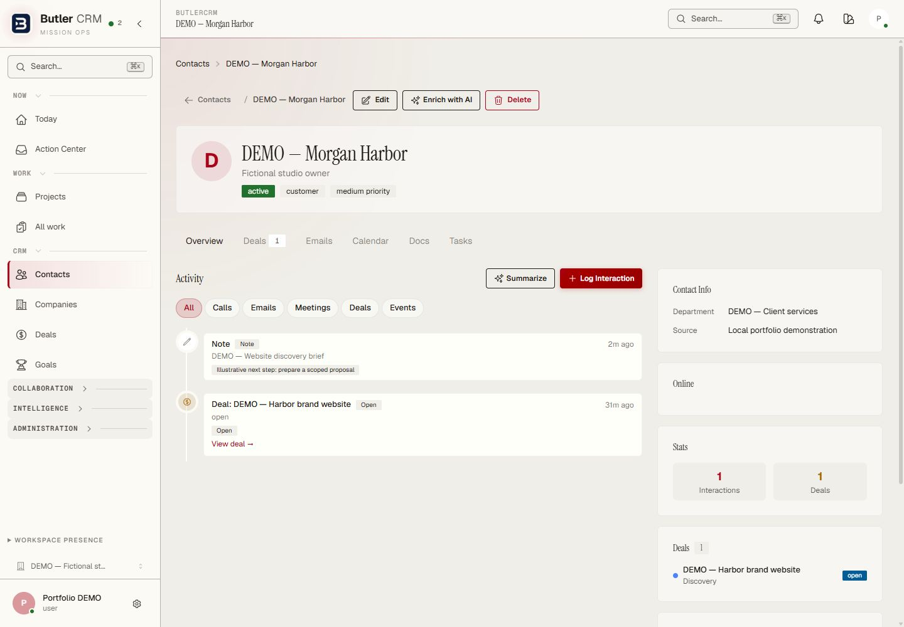
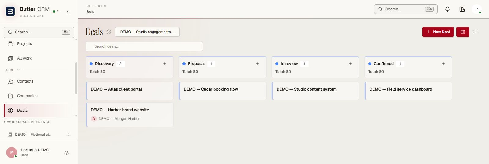
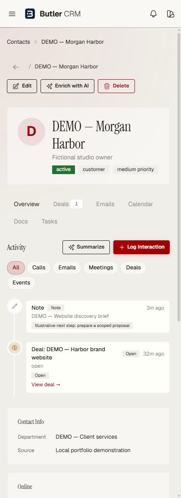
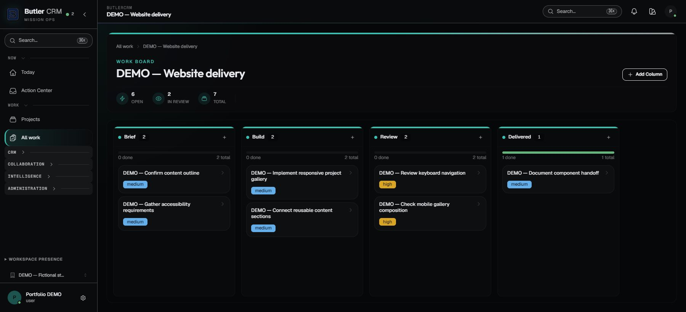
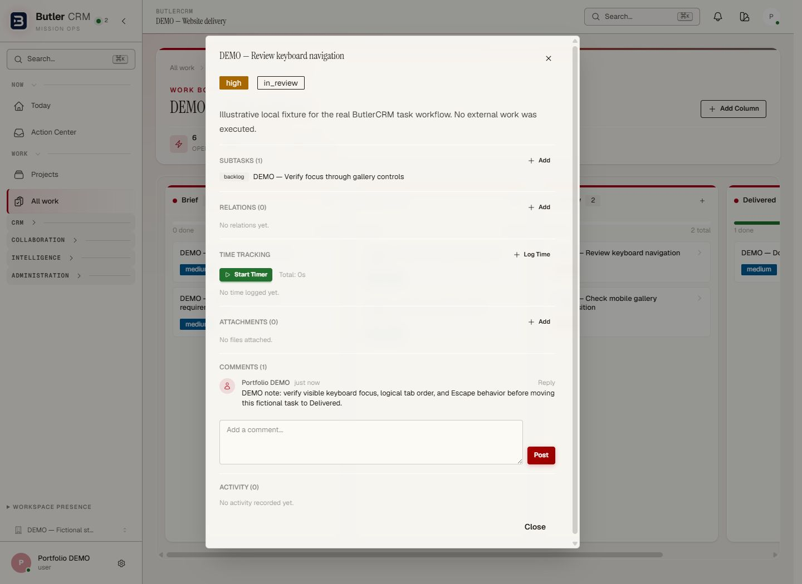
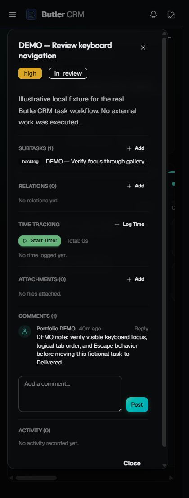

# ButlerCRM — from customer context to delivered work

I built ButlerCRM with Elixir, Phoenix LiveView and PostgreSQL to connect
customer relationships, projects and the work a team needs to deliver.

The screenshots below show the actual application running locally with
fictional demo records, captured September 5, 2026. The production source
is private.

## Keep the customer relationship in context

The customer record brings identity, status, activity history and linked
opportunities into one view. This fictional example connects a discovery
note with its related website opportunity.

The sales pipeline groups opportunities by stage. Here, five fictional
opportunities sit across discovery, proposal, review and confirmation. Deal
values are unpopulated; the displayed totals are not sales results.

## Make the next step visible

A project board gives work a clear path from brief to build, review and
delivery. Tasks remain visible in their current stage, with priority labels
and stage counts that make it easier to see what needs attention.

## Keep the detail with the task

Opening a task preserves the surrounding project context. Its description,
subtasks, related records, time tracking, attachments and conversation share
one detail view. The example shows a review task with a subtask and a comment.

## Carry the workflow onto a smaller screen

The task detail adapts to a narrow viewport while retaining the same work
record and controls. This keeps the desktop and mobile experience connected.

## Engineering approach

Phoenix LiveView keeps the interface tied to application state, backed by
PostgreSQL. The work board is part of the wider CRM application shell, alongside
project navigation, collaboration and administration.

[Capture provenance](../assets/butlercrm/README.md) describes the isolated
demo environment and what these examples establish.
