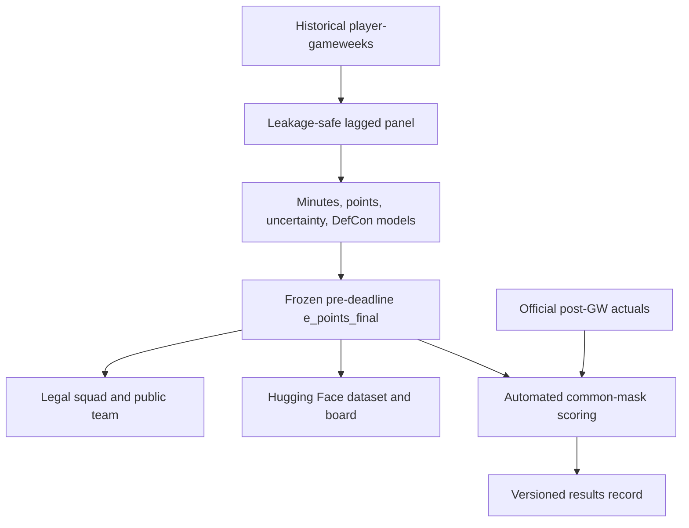

# fplbench — A Forecast That Has to Face the Scoreboard

**Publication status:** published 
**Project status:** live 2026/27 benchmark 
**Domains:** applied machine learning, sports analytics, data engineering, MLOps 
**Evidence reviewed:** 24 August 2026 
**Public proof:** [source](https://github.com/PascalAI2024/fplbench) ·
[dataset](https://huggingface.co/datasets/x0me/fplbench) ·
[live board](https://huggingface.co/spaces/x0me/fplbench-board)

## The brief

Build an open Fantasy Premier League model whose claims can survive the season:
predictions frozen before each deadline, a legal squad chosen by the model, and
scoring performed automatically after official results arrive.

## The constraints

FPL data makes accidental leakage easy. Post-match expected-points fields look
like useful training features, playing time dominates point outcomes, and the
new Defensive Contribution rule needs a separately calibrated probability.
Live evaluation also needs to score the exact forecast used to rank the squad,
not a convenient intermediate model output.

## The decisive move

The project treats time and publication as part of the model contract:

1. Lag performance features within player and season.
2. Keep post-match FPL estimates out of training.
3. Predict minutes, base points, uncertainty, and DefCon separately.
4. Compose the published `e_points_final` score before the deadline.
5. Commit that artifact, select the squad from it, and grade that same column
   after the gameweek.

## The system shape

## The evidence

- The published base-points model reports **0.8757 MAE on 29,428 common
  holdout rows**, against 1.0534 for the rolling last-five baseline. The source
  artifact is
  [`val_metrics.json`](https://github.com/PascalAI2024/fplbench/blob/main/outputs/models/val_metrics.json).
- The DefCon classifier reports **0.818 AUC** on its separately documented
  post-GW28 holdout.
- The
  [workflow](https://github.com/PascalAI2024/fplbench/actions/workflows/fplbench.yml)
  publishes predictions, tracks the public team, self-scores finished
  gameweeks, and refreshes both Hugging Face surfaces.
- The live scorer fails closed if the published `e_points_final` column is
  absent. It does not silently substitute the raw points head.

The first live season is intentionally separate from the historical holdout.
As of the review date, GW1 was still open, so no provisional number was
presented as a final result.

## The learning

A credible public model is an operating system as much as an estimator. The
freeze, provenance, scoring contract, and correction history are what let a
reader judge the prediction after the interesting part—the future—becomes the
past.

## The boundary

No FPL credentials or private account state are published. The TabFM comparison
uses non-commercial research weights and is not the production path. Historical
base-points metrics and live DefCon-inclusive scoring are named separately so
their validation windows are not conflated.
