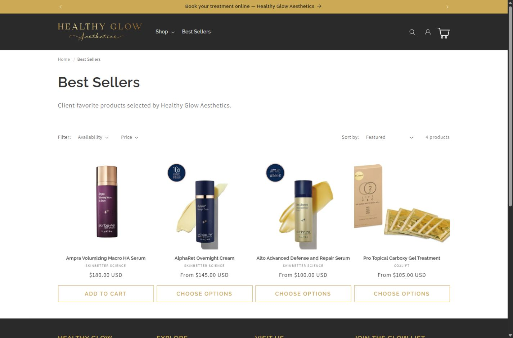
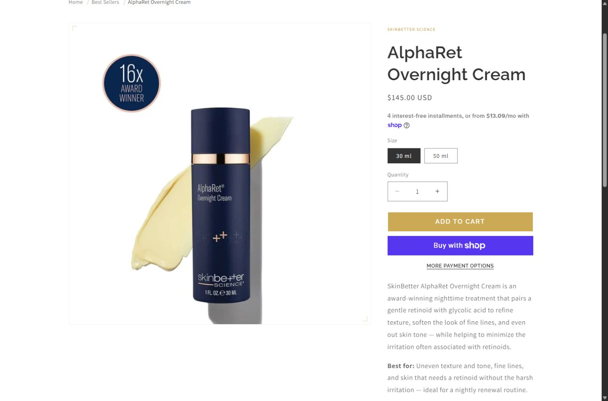
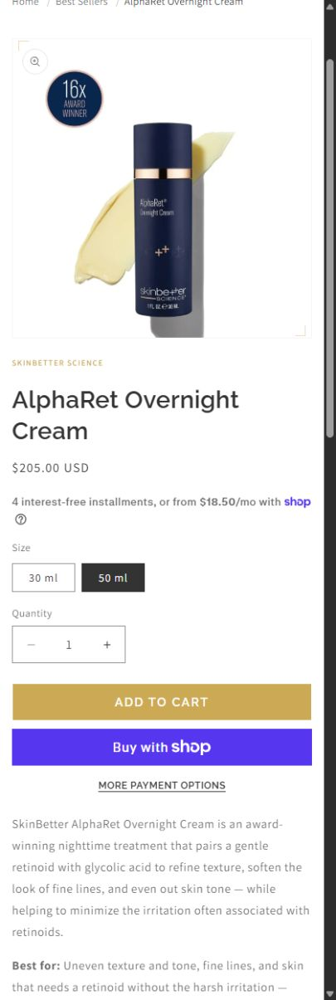

# Healthy Glow — a branded Shopify shopping experience

**Client e-commerce · Shopify development · Private source**

[Explore the live shop](https://shop.healthyglowaesthetics.com/) · [Back to selected work](../README.md#the-work)

Healthy Glow needed its skincare shop to feel connected to its aesthetics
website, while giving customers practical ways to find a product.

I customized Shopify Dawn with Liquid, JavaScript and CSS, carrying the
brand through collection and product layouts. Discovery by skin concern,
category and brand, plus metafield-driven navigation, gives the client
content they can manage in Shopify Admin.

## From collection to product

The collection view brings filtering, sorting and product options together.
The product page puts the image, description, size, price and quantity
controls in one readable flow.

## Shopping on a phone

These are public storefront captures from September 5, 2026. The desktop
product shows the 30 ml variant; mobile shows 50 ml, so their prices differ.
Product claims and prices are the shop's content, not measured project results.

[Visit the shop](https://shop.healthyglowaesthetics.com/) · [Capture sources](../assets/healthy-glow-shopify/README.md)
