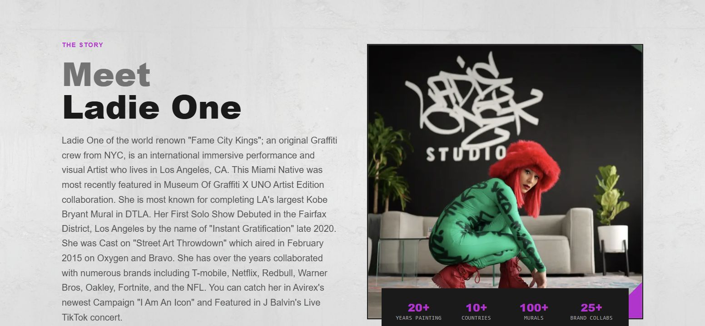
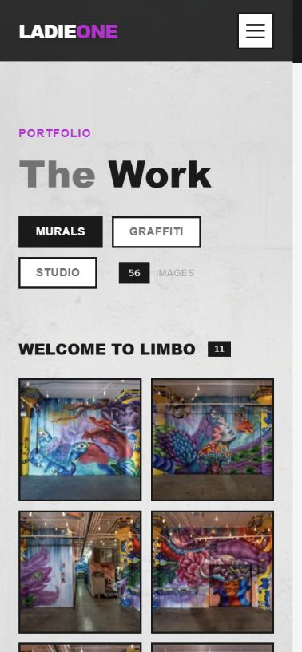
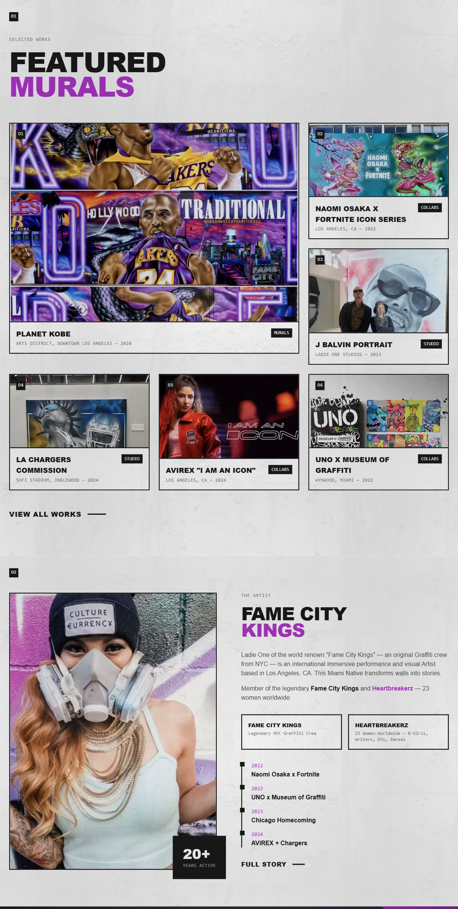

# Ladie One — an artist portfolio with room for the work

**Client website · Design and development · Private source**

[Visit the live artist website](https://ladieone.com/) · [Back to selected work](../README.md#the-work)

*Website design and development by Ingenious Digital. Artwork, collaborations
and artist milestones belong to Ladie One. Captured September 5, 2026.*

## The brief

An artist's site has to make the work easy to explore without turning every
piece into the same thumbnail. Ladie One's portfolio spans large murals,
studio pieces and collaborations, with an artist story behind them.

## What I built

- **An editorial homepage:** an asymmetric selected-work grid gives a lead
  mural more space while keeping the surrounding projects visible. Large
  typography, restrained purple accents and textured surfaces carry the
  artist's visual identity through the site.
- **A browsable body of work:** category controls and image galleries help
  visitors move between mural, graffiti and studio work. The image viewer
  supports keyboard navigation and Escape to close.
- **A connected artist story:** biography, press and collaboration pages
  provide context alongside the artwork. Responsive layouts keep category
  controls and images useful on a phone.
- **A direct inquiry path:** the contact page brings the existing Square
  booking panel into the website for studio-visit inquiries.

The implementation uses Next.js, React, TypeScript, Tailwind CSS and Framer
Motion. The important decision was to give different kinds of content their
own hierarchy while retaining one recognizable visual system.

## Explore the delivered interface

### Artist biography

*Portrait, biography and career milestones give the artwork context.*

### Mobile browsing

*The implemented gallery on a phone, with its category controls in view.*

See the continuous homepage: selected work into the artist story

[Visit the website](https://ladieone.com/) ·
[Capture notes and development scope](../assets/ladie-one/README.md)
