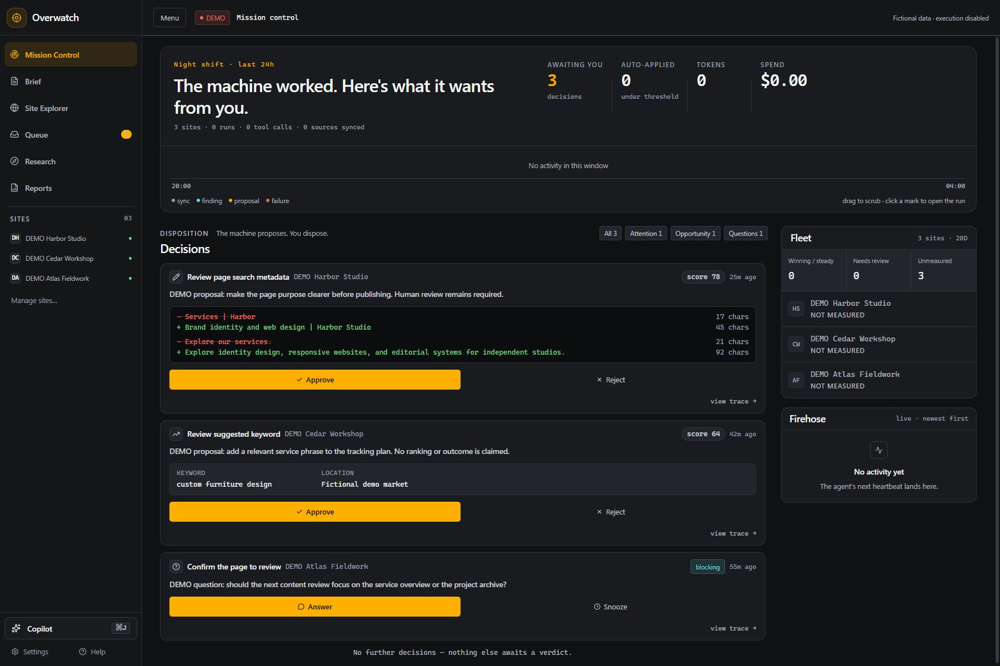
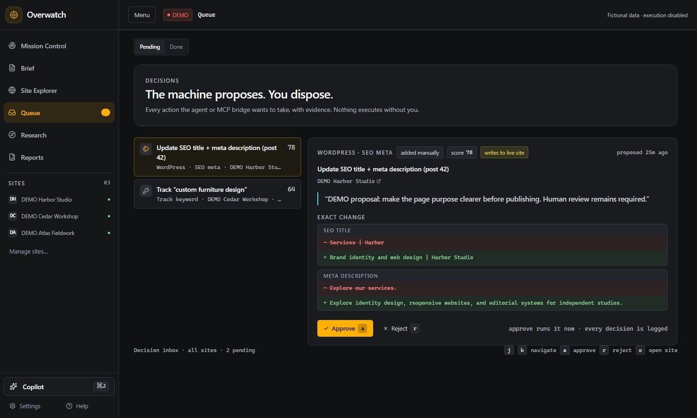
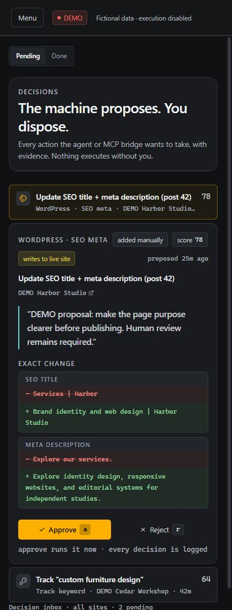

# Overwatch — Search Intelligence as One Working Surface

**Publication status:** public-safe narrative
**Project status:** source-private product work
**Domains:** product engineering, analytics, search, human-in-the-loop AI
**Visual examples:** actual application routes with fictional demo data, September 5, 2026

## The brief

Bring rank tracking, search performance, local visibility, and AI-era search
signals into one self-hosted decision surface rather than scattering work
across specialist dashboards.

## Constraints

Search data is heterogeneous, budget-sensitive, and tied to customer sites.
Any AI-assisted action needs a visible approval boundary rather than silent
automation.

## The decisive move

The product combines several search and analytics signals around a shared
project workspace, then treats AI as an operator assistant that can propose
work within human review.

## The system shape

A web application gathers search, analytics, business-profile, and web-vitals
signals into a project view. Background work keeps the picture current; an
approval-aware assistant turns that picture into proposed actions.

## Review work across sites

Mission Control brings pending decisions and site context into a shared
workspace. The example includes a proposed metadata revision, a keyword
tracking suggestion and a question requiring a decision.

## See the exact change before approving it

The queue keeps the proposal list beside its evidence and proposed changes.
Selecting an item reveals the affected content and a before-and-after view,
so the operator can review a specific edit rather than accept a vague summary.

The same queue adapts to a narrow screen, keeping the proposed changes and
decision controls together.

## Evidence posture

The production application is login-gated and its source is private. These
captures render the released interface components in an isolated local harness
with fictional loader data and mutations disabled. They demonstrate the UI
and its selection/review interaction; they do not demonstrate a live backend
action, measured search performance or customer outcomes.

[Capture provenance](../assets/overwatch/README.md) records the scope.

## Outcome or learning

The product demonstrates that reporting becomes more useful when it is designed
as a working surface for decisions, not merely a chart collection.

## The boundary

The examples contain fictional site names and proposals. Private customer
records, credentials and provider configuration remain outside the gallery.
