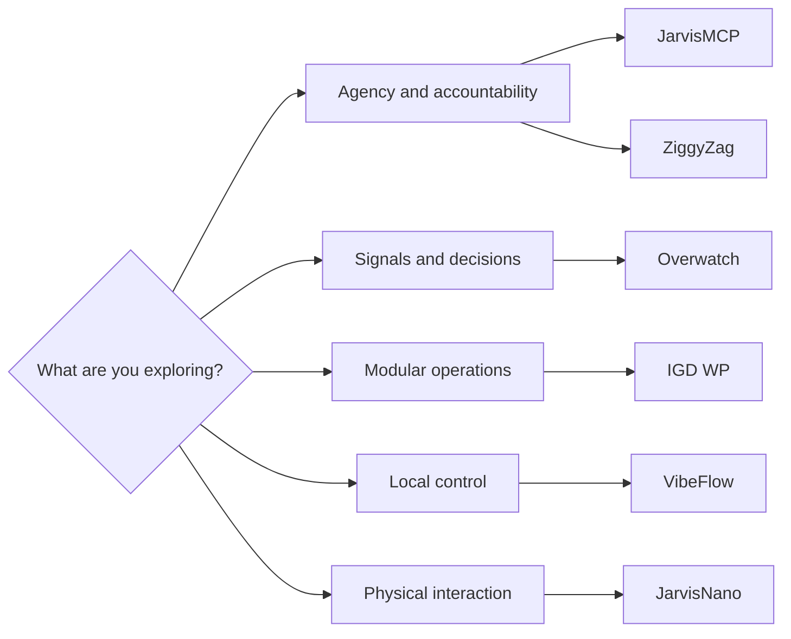

# Portfolio Atlas

The quickest way through this repository is to follow a question, not a tech
stack. Each route links a high-level system shape to a selected case study and
its public proof.

## Routes through the work

| Route | Best first read | Then inspect | The point of the route |
| --- | --- | --- | --- |
| Agency and accountability | [JarvisMCP](../case-studies/jarvismcp.md) | [Human-in-the-loop boundary](../architecture/human-in-the-loop.md), [ZiggyZag](../case-studies/ziggyzag.md) | Useful capability needs a visible approval and trust boundary. |
| Signals and decisions | [Overwatch](../case-studies/overwatch.md) | [Capability map](../capabilities/README.md) | A dashboard becomes more valuable when it helps a person decide what to do next. |
| Modular operations | [IGD WP](../case-studies/igd-wp.md) | [Capability constellation](../architecture/capability-constellation.md) | Optionality is an architectural choice, not a pile of settings. |
| Local control | [VibeFlow](../case-studies/vibeflow.md) | [ZiggyZag](../case-studies/ziggyzag.md) | Privacy and human control can be product defaults. |
| Physical interaction | [JarvisNano](../case-studies/jarvisnano.md) | [Capability constellation](../architecture/capability-constellation.md) | Hardware is most useful when its state is readable to the person using it. |

## How to read a story

Every selected study follows the same evidence sequence:

1. A real product brief.
2. The constraint that made the brief non-trivial.
3. A decisive product or system move.
4. A public-safe description of the system shape.
5. Public proof and an explicit boundary.

The [proof standard](../proof/README.md) defines what belongs here. The
[public boundaries](../PUBLIC_BOUNDARIES.md) define what does not.
