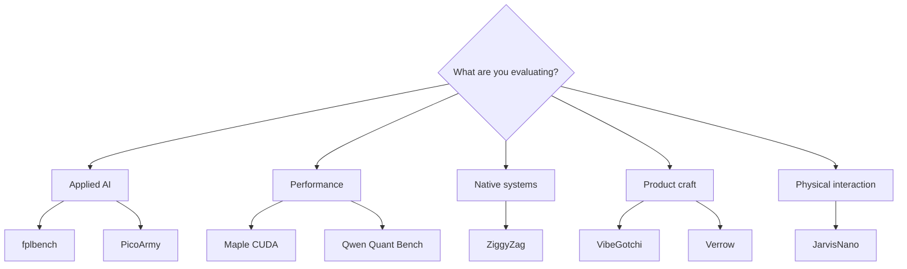

# Portfolio Atlas

Choose a route based on the question you need answered.

## Routes through the work

### I need evidence that a model can be operated honestly

Start with [fplbench](../case-studies/fplbench.md), then inspect the
[evidence ledger](../proof/README.md). The important artifact is the chain from
pre-deadline forecast to official post-gameweek scoring.

### I need low-level performance and research depth

Start with [Maple CUDA](../case-studies/maple-cuda.md), then read
[Qwen Quant Bench](../case-studies/qwen-quant-bench.md). Together they show
kernel work, controlled comparisons, correctness checks, negative results, and
measurement corrections.

### I need native product engineering

Start with [ZiggyZag](../case-studies/ziggyzag.md). Its shell, terminal host,
launcher, and local agent expose clear process and approval boundaries.

### I need a live product rather than an architecture document

Open [VibeGotchi](../case-studies/vibegotchi.md) and use its demo states. Then
inspect [Verrow](https://github.com/PascalAI2024/verrow) for a more operational
data-product prototype.

### I need hardware and interaction work

Start with [JarvisNano](../case-studies/jarvisnano.md). The public record covers
the active hardware target, display ownership, audio and touch paths, and device
diagnostics without publishing device secrets.

## Reading standard

Each route ends at source, a live surface, a reproducible artifact, or an
explicit limitation. Source-private narratives are available in the
[case-study index](../case-studies/README.md), but they do not substitute for
public proof.
